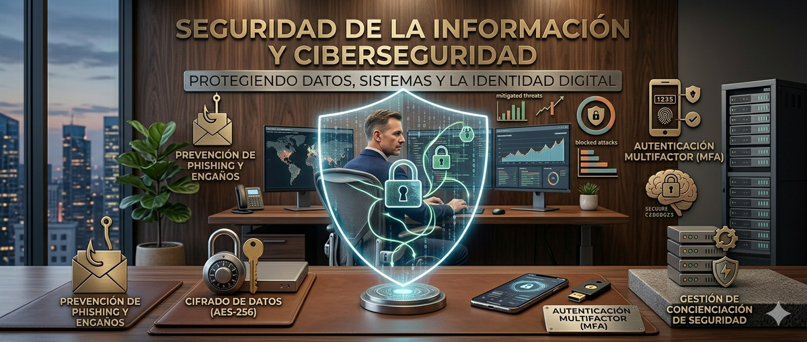

# 💻 Seguridad y Salud en el Trabajo: Entornos Informáticos

## 📋 Índice
1. Introducción
2. Riesgos Ergonómicos
3. Fatiga Visual y Pantallas
4. Riesgos Psicosociales en el Sector IT
5. Seguridad Eléctrica y del Entorno
6. Plan de Prevención (Checklist)
7. Referencias
8. Autores

## 📑 Introducción
En la era digital, el trabajo de oficina y el desarrollo de software presentan riesgos específicos que, aunque menos visibles que en la industria pesada, pueden derivar en patologías crónicas. La prevención es la clave para la sostenibilidad del talento humano.
